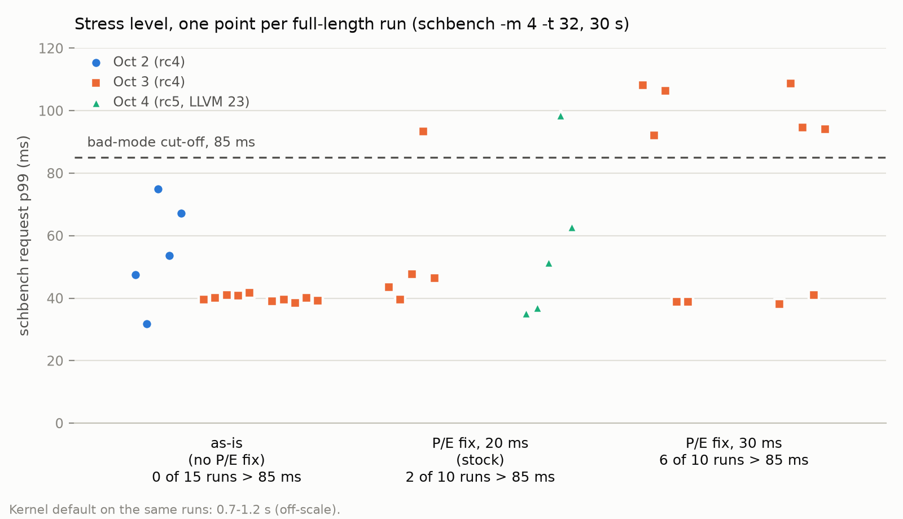

# Case study: i7-1260P

Pavel Shago · 2026-10-04

## TL;DR

Recommended i7-1260P setup: stock scx_A1349 defaults plus a P/E detection fix, no tuning flags. Against the kernel default on 7.3-rc5 it scores 1.37 overall (geomean of five metric ratios, >1 = better).

- **P/E misdetection.** With SMT on, the kernel reports `cpu_capacity = 1024` on all 16 CPUs, so A1349 ran as a homogeneous scheduler with no E cluster. Reading `acpi_cppc/highest_perf` instead (P=60, E=34) fixed it. On full-length stress runs the fixed build only ties the as-is one (1.97 vs 1.92).
- **Tuning found little.** Eight tunables were exposed as loader flags and swept in three stages. Only slice length moved the score; the rest were inert or worse than default.
- **The 30 ms trap.** A 30 ms slice won the short-run sweep, but full-length stress runs showed a bimodal tail: 6 of 10 runs hit ~92–109 ms request p99 instead of ~40 ms. It was rejected; 20 ms (the default) shows it in about 1 run in 5.
- **Where it wins.** schbench under load: 1.53× RPS and 14.7 vs 54.2 ms request p99 at moderate; 3.78× RPS and 52 vs 984 ms at stress.
- **Where it loses.** Light load (schbench RPS 0.83×), wakeup p99 at moderate and stress, and sysbench under stress (0.76×).

## Hardware & setup

One laptop, on AC, everything else idle; each scheduler is compared against the kernel default (fair class, no sched_ext scheduler attached) on the same boot.

| Item | Value |
| --- | --- |
| CPU | Intel Core i7-1260P: 4 P-cores (CPUs 0–7, SMT) + 8 E-cores (CPUs 8–15), 16 threads |
| Memory | 15 GB |
| Kernel | Arch 7.3.0-rc4-1 for the sweep; 7.3.0-rc5-1 rebuilt with LLVM 23 (clang 23.1.1) for the final runs |
| Power | `platform_profile=performance`, intel_pstate active, `powersave` governor, EPP `balance_performance` |
| Scheduler | scx_A1349 (sched_ext), commits `b4f8812` and `09fb5cf` |

Workloads come from `benchmarks/collect.py` (`workload_profile()`, `SchbenchSource._sizing()`), sized for 16 CPUs:

| Level | hackbench args | sysbench oltp_read_only threads | schbench -m × -t |
| --- | --- | --- | --- |
| light | `-l 10000` | 1 | 1 × 4 |
| moderate | `-g 4 -l 120000` | 4 | 2 × 16 |
| stress | `-g 10 -l 50000` | 16 | 4 × 32 |

sysbench runs against a local PostgreSQL. Full-length phases are sysbench 10 s and schbench 30 s with a 3 s cooldown. The harness also records the `sched_latency` BPF tool and RAPL power; average power stayed within 2 W of the default (66–73 W) at every level.

## Finding: SMT hides the P/E split

On this part with SMT on, `/sys/devices/system/cpu/cpu*/cpu_capacity` reads 1024 on all 16 CPUs. intel_pstate enables hybrid capacity scaling only when SMT is off; with SMT it relies on ITMT priorities instead. The A1349 loader classified P/E from `cpu_capacity`, so it saw 16 identical P CPUs: the E cluster, P→E spill and E→P steal never ran.

**Fix (in `b4f8812`).** When `cpu_capacity` is uniform and `/sys/devices/cpu_atom` exists (Intel hybrid), the loader scales capacities from `acpi_cppc/highest_perf` instead: P = 60, E = 34, so E = 580/1024, σ = 1.766, and the auto-derived `cost_e` = 580. The `cpu_atom` gate keeps AMD preferred-core CPPC rankings from being read as a P/E split.

The loader's own log, stress level, one run each:

| Loader output | As-is (rc4 baseline) | With CPPC fix (rc5 final) |
| --- | --- | --- |
| Topology line | `p_cores=16 e_cores=0 (homogeneous)` | `p_cores=8 e_cores=8 (heterogeneous, acpi_cppc)` |
| σ, cost_e | 1.000, 1024 | 1.766, 580 |
| enq_e | 0 | 142,088 |
| spill (P→E) | 0 | 126,955 |
| steal | 0 | 729,239 |

The fix is what makes A1349 a heterogeneous scheduler on this machine at all. Its measured benefit is smaller than that suggests. In stage A's short runs it raised the overall score from 1.31 to 1.40, almost all at stress (1.81 → 2.08). In full-length stress runs (stage D, same day, 5 runs each) fix + 20 ms scored 1.97 vs as-is 1.92: a tie, trading request p99 (median 46 vs 39 ms) for wakeup p99 (25 vs 32 ms).

## Method

The BPF `#define` tunables became `const volatile` rodata set by loader flags, with defaults unchanged, then were swept by staged coordinate descent against the kernel default.

| Flag | Default | Controls | What the sweep showed |
| --- | --- | --- | --- |
| `--slice-us` | 20000 | P-core slice; also the φ length quantum | The only knob that moved the score (stages A–C) |
| `--slice-e-pct` | 150 | E-core slice, % of P slice | Not swept separately |
| `--budget-mul` | 16 | Budget cap B_max = weight · N | Removing the budget loses |
| `--replenish-div` | 6000000 | Budget += sleep_ns · weight / N | 4× faster refill loses |
| `--starve-floor` | 10 | Enqueue to STARVED below N % of B_max | 0 (off) loses |
| `--starved-wait` | 5 | STARVED head wait bound, P slices | 2 loses clearly, 10 slightly |
| `--cluster-wait` | 25 | Cluster DSQ wait bound, P slices | Never fired (`demote=0` in every run) |
| `--wbar-den` | 16 | W̄ EWMA denominator | Inert at this scale (below) |
| `-p` / `-e` | 1024 / auto (580) | Per-quantum cost on P / E | `-p 256` loses; `-p 4096` within noise |
| `-d` | 0.98 | MDP discount δ | Inert at this scale (below) |
| `--idle-pick` | `pscan` | Wake-up CPU pick | `core` trades light wakeup p99 for light RPS; stays opt-in |

`--idle-pick core` is new: it uses `scx_bpf_select_cpu_and()` to try an idle whole P core, then an idle whole core anywhere, then any idle thread, keeping the kernel's prev_cpu and WAKE_SYNC logic. `pscan` takes the lowest-numbered idle P thread.

**Inert knobs.** The externality term (δ^m_j − δ^m_i)·W̄ is below 1 φ unit while φ_j ≈ 200, because W̄ measured about 1–7. So δ and `--wbar-den` cannot change an ordering here. The budget, by contrast, fires constantly: `enq_starved` is about equal to or larger than `enq_p`, so half or more of all enqueues land below the starve floor.

**Stage protocol.**

1. Each stage runs a set of A1349 configs plus the kernel default, interleaved in a fresh random order every round.
2. 3 rounds × 3 levels, with shortened phases: sysbench 6 s, schbench 12 s, cooldown 2 s; hackbench is fixed by level.
3. The winner's slice and flags carry into the next stage; the finalist is then validated with full-length runs (5 rounds, sysbench 10 s, schbench 30 s).

**Score.** Five metrics, each a ratio vs the default oriented so >1 is better: hackbench time (lower), sysbench TPS (higher), schbench average RPS (higher), schbench request p99 (lower), schbench wakeup p99 (lower). Sweeps use the median over rounds; full runs use the mean.

```math
\mathrm{score}_{\ell} = \Big(\prod_{k=1}^{5} r_{k,\ell}\Big)^{1/5}, \qquad \mathrm{overall} = \Big(\prod_{\ell \in \{\mathrm{light},\,\mathrm{moderate},\,\mathrm{stress}\}} \mathrm{score}_{\ell}\Big)^{1/3}
```

A geomean of ratios ranks configs the same whatever the reference, but the default's stress tail (request p99 0.75–1 s) inflates absolute scores. The default's own numbers drift up to ±20% between sessions, so scores compare only within one stage.

## Sweep results (stages A–C)

The CPPC fix plus a 20–30 ms slice came out on top in every stage; no budget, cost or wait change beat it. All scores are vs the kernel default within the same stage, on 7.3-rc4.

**Stage A — detection fix and slice length** (3 rounds; raw data lost when a reboot wiped `/tmp`, scores only):

| Config | Light | Moderate | Stress | Overall |
| --- | --- | --- | --- | --- |
| s20 (CPPC fix, 20 ms) | 1.06 | 1.25 | 2.08 | **1.40** |
| s20 + `--idle-pick core` | 1.03 | 1.22 | 2.10 | 1.38 |
| asis (original binary, homogeneous) | 1.03 | 1.21 | 1.81 | 1.31 |
| s10 | 1.13 | 1.17 | 1.62 | 1.29 |
| s5 | 1.05 | 1.14 | 0.89 | 1.02 |
| s3 | 1.06 | 0.97 | 0.64 | 0.87 |

Short slices collapse schbench under stress back toward the default's ~1 s request p99; the slice is also the φ length quantum, so it changes ranking, not just preemption. `--idle-pick core` gave +14% light schbench RPS and +6% sysbench but light wakeup p99 rose from 81 to 111 µs.

**Stage B — budget and longer slices** (final 3-round log lost; 2-round interim overall scores):

| Config | Overall |
| --- | --- |
| s30 | **1.52** |
| s20 | 1.48 |
| nobudget (`--budget-mul 100000 --starve-floor 0`) | 1.42 |
| refill4x (`--replenish-div 1500000`) | 1.40 |
| nofloor (`--starve-floor 0`) | 1.39 |
| s40 | 1.33 |

Removing the budget floods P→E spill: 686k spills per run vs 9k with it.

**Stage C — cost and STARVED wait** (3 rounds, after the reboot; `results/tune/C_cost_wait`):

| Config | Light | Moderate | Stress | Overall | Stress request p99, median (ms) |
| --- | --- | --- | --- | --- | --- |
| s30 `-p 4096` | 0.996 | 1.113 | 2.179 | **1.342** | 37.8 |
| s30 | 0.992 | 1.113 | 2.138 | 1.331 | 38.8 |
| s20 | 0.995 | 1.112 | 2.054 | 1.315 | 41.8 |
| s30 `--starved-wait 10` | 0.991 | 1.113 | 2.035 | 1.309 | 48.7 |
| s30 `--starved-wait 2` | 0.997 | 1.109 | 1.665 | 1.226 | 67.5 |
| s30 `-p 256` | 0.991 | 1.113 | 1.364 | 1.146 | 102.0 |

Everything that matters happens at stress; light and moderate scores agree to the third decimal. `-p 4096` is within noise of s30. `-p 256` roughly triples the stress tail (wakeup p99 72.8 vs 20.2 ms), and `--starved-wait 2` doubles it. On these short runs s30 looked like the winner.

## Validation: the 30 ms trap

Full-length runs rejected the stage C winner: a 30 ms slice has a bimodal stress tail that 12 s runs with a median of 3 rounds could not show.



In the bad mode request p99 is 92–109 ms and wakeup p99 58–83 ms, against 38–41 ms and about 20 ms otherwise; the 85 ms cut-off sits in the empty gap between the two clusters. schbench throughput does not change (about 2,570–2,600 RPS in both modes), so only the tail metrics see it. At 20 ms the bad mode appeared in 1 of 5 runs on each day. The as-is build was clean on Oct 3 (0 of 10) but spread from 32 to 75 ms in the Oct 2 baseline.

On full-length stress runs fix + 30 ms scored 1.44 against 1.97 for fix + 20 ms (stage D), and 1.16 overall against 1.27 for as-is in `final_i7`. The 30 ms slice was dropped and the stock 20 ms kept.

**Lesson:** score tail metrics on full-length runs and count bad-mode runs per config. A median of 3 short runs hides a mode that hits half of all runs.

## Final results on 7.3-rc5 (LLVM 23)

Stock A1349 with the CPPC fix scores 0.99 / 1.32 / 1.95 at light / moderate / stress, 1.37 overall, against the kernel default. Run with `run_suite` on 2026-10-04: 5 full-length runs per level, scheduler order interleaved (`results/20261004_003922`).

Each cell is scx_A1349 / default, then the ratio oriented so >1 favours A1349. Means of 5 runs; the stress tail rows use medians because the distribution is bimodal (next section).

| Metric | Light | Moderate | Stress |
| --- | --- | --- | --- |
| hackbench time (s) | 5.5 / 5.5 (1.01) | 31.4 / 33.5 (1.07) | 32.8 / 33.0 (1.01) |
| sysbench TPS | 2336 / 2495 (0.94) | 6866 / 5925 (1.16) | 9526 / 12546 (0.76) |
| schbench avg RPS | 1168 / 1407 (0.83) | 2407 / 1570 (1.53) | 2487 / 658 (3.78) |
| schbench request p99 | 5.3 / 5.0 ms (0.94) | 14.7 / 54.2 ms (3.68) | median 52 / 984 ms |
| schbench wakeup p99 | 80 / 104 µs (1.31) | 7.0 / 4.1 ms (0.58) | median 24 / 18 ms |
| **Level score** | **0.99** | **1.32** | **1.95** |

At stress the means are request p99 57 / 994 ms and wakeup p99 33 / 19 ms; one of the five A1349 runs was in the bad mode (99 ms request, 74 ms wakeup). The 95% CIs on the default's moderate and stress request p99 are wide (±19 ms and ±198 ms).

The first rc4 baseline (2026-10-02, `results/20261002_194830`, A1349 before the fix) scored 1.44 overall with the same harness. rc4 and rc5 were never A/B'd on one boot, and the 1.44 vs 1.37 gap is inside session-to-session noise.

## Where A1349 wins and loses

A1349 wins big on schbench throughput and request tail once the machine is loaded, and loses on wakeup tail under load, sysbench under stress and schbench at light load. The pattern holds in all three sessions that ran the stock 20 ms slice: rc4 baseline (Oct 2, as-is), `final_i7` as-is (Oct 3), rc5 final (Oct 4, with fix).

| Level | Metric | A1349 vs default, range of mean ratios (>1 = A1349 better) | Verdict |
| --- | --- | --- | --- |
| stress | schbench request p99 | 17.4–18.3× | Win: default sits at 0.7–1.2 s |
| stress | schbench avg RPS | 3.78–3.82× | Win |
| moderate | schbench request p99 | 2.23–3.90× | Win |
| moderate | schbench avg RPS | 1.53–1.59× | Win |
| light | schbench wakeup p99 | 1.18–1.31× | Win (80–88 vs 100–108 µs) |
| moderate | sysbench TPS | 1.07–1.16× | Win |
| moderate | hackbench time | 1.05–1.07× | Small win |
| light, stress | hackbench time | 1.01–1.08× | Neutral |
| light | sysbench TPS | 0.94–1.07× | Neutral |
| light | schbench request p99 | 0.67–1.00× | Neutral to loss |
| light | schbench avg RPS | 0.82–0.87× | Loss |
| stress | schbench wakeup p99 | 0.47–0.83× | Loss |
| stress | sysbench TPS | 0.72–0.76× | Loss |
| moderate | schbench wakeup p99 | 0.47–0.68× | Loss (5.9–7.0 vs 2.8–4.5 ms) |

The light-load RPS gap looks like wake placement: `--idle-pick core` raised light RPS by 14% in stage A by spreading wakeups across whole cores, at the cost of light wakeup p99 (81 → 111 µs). The causes of the stress sysbench loss and the moderate/stress wakeup tail were not investigated.

## Caveats & open questions

The biggest open item is the stress-tail bad mode: it survives at the default 20 ms slice and its cause is unknown.

- **Bad mode at 20 ms.** 1 of 5 full-length stress runs on Oct 3 (93 ms request p99) and 1 of 5 on Oct 4 (99 ms). Longer slices make it more frequent (30 ms: 6 of 10). Open: what tips a run into it, and whether STARVED-queue aging or E-cluster steal is involved.
- **Light-load gap.** schbench RPS is 0.82–0.87× the default at light load in every session. Open: whether a placement policy can recover it without the wakeup-latency cost of `--idle-pick core`.
- **Idle-pick spreading.** The 81 → 111 µs wakeup p99 with `--idle-pick core` is attributed to the kernel picker spreading wakeups onto cores in deeper C-states, while `pscan` reuses warm low-numbered CPUs. Not verified with C-state residency data.
- **Fix vs as-is.** On full-length stress runs the CPPC fix ties the homogeneous as-is build (1.97 vs 1.92). The P/E machinery runs, but has not yet shown a clear gain on this part.
- **Inert mechanism.** With W̄ ≈ 1–7, the VCG externality term is under 1 φ unit, and `--cluster-wait` never fired. In practice ranking is φ plus the budget and STARVED queue.
- **Session noise.** The default's own numbers drift by up to ±20% between sessions; only within-session ratios are compared. rc4 and rc5/LLVM 23 were not A/B'd on one boot.
- **Lost data.** Stage A raw data and the final stage B log were lost in a reboot that wiped `/tmp`; those numbers come from notes. Later stages write under `results/tune/`.
- **Short-run sweeps.** 12 s schbench phases with a median of 3 rounds cannot see a 1-in-2 bad mode, let alone 1-in-5. Rankings within about 0.05 overall in stages A–C are not reliable.
- **Scope.** One laptop, AC power, `performance` profile, SMT on. Not tested: SMT off (where `cpu_capacity` is populated), battery or balanced EPP, other hybrid parts.

## Reproduce / artifacts

The scheduler changes (commits `b4f8812`, `09fb5cf`) and the helper scripts `benchmarks/tune.py`, `benchmarks/summarize.py` and `benchmarks/plot_bad_mode.py` are in this repo. The `results/` and `plots/` paths below are gitignored, so they exist only on the machine that ran the benchmarks.

| Artifact | Path | Contents |
| --- | --- | --- |
| Final run (rc5) | `results/20261004_003922`, `plots/20261004_003922` | default vs stock A1349 + fix, 5 runs × 3 levels |
| Same-day 30 ms check | `results/tune/D_stress_tail` | stress only: default, as-is, fix + 20 ms, fix + 30 ms, 5 runs each |
| Full-length validation | `results/tune/final_i7`, `plots/final_i7` | default, as-is, fix + 30 ms, 5 runs × 3 levels |
| Stage C sweep | `results/tune/C_cost_wait` | 6 configs + default, 3 short rounds |
| rc4 baseline | `results/20261002_194830` | default vs as-is (ignore the other scheduler in it) |
| Stages A, B | (lost) | numbers in this note only |

Each level directory holds `oneshot_summary.json` and `*_aggregate.csv`; each run directory holds the run's `meta.json` and `scheduler.log` with A1349's counters.

**Commands** (all read-only on existing data):

```
# mean ± 95% CI tables vs the default
python benchmarks/summarize.py results/20261004_003922 default

# re-score a sweep stage (median over rounds)
python benchmarks/tune.py C_cost_wait --report
python benchmarks/tune.py D_stress_tail --report

# redraw the per-run stress chart in this note
python benchmarks/plot_bad_mode.py
```

Python dependencies are listed in `benchmarks/pyproject.toml`. New runs: `benchmarks/run_suite.py --runs 5` for a full suite, `benchmarks/tune.py STAGE --bin <scx_A1349> --cfg label='--flags'` for a sweep stage. Both need sudo to attach the scheduler and hackbench and sysbench on `PATH`.

**Environment notes.**

- hackbench (rt-tests) and sysbench with the pgsql driver are not in the Arch repos; both are built from source into `~/.cache/a1349-bench/tools/bin`.
- sysbench uses a user-local PostgreSQL in `~/.cache/a1349-bench/pg` (`sbtest`, 4 tables × 100,000 rows, 127.0.0.1:5432).
- After the LLVM 23 upgrade the system bpftool was broken (still linked to LLVM 22). Rebuilding the kernel / linux-bpf package with LLVM 23 (7.3.0-rc5-1) fixed it.
- P/E inputs: `/sys/devices/system/cpu/cpu*/cpu_capacity` (all 1024 with SMT on), `/sys/devices/system/cpu/cpu*/acpi_cppc/highest_perf` (60 / 34), `/sys/devices/cpu_atom/cpus` (8–15). The loader prints its view on start: `p_cores=8 e_cores=8 (heterogeneous, acpi_cppc)`.
